# Natours アプリケーション概要

## はじめに

このドキュメントは、Natours アプリケーションの高レベルな概要を提供します。ツアー予約プラットフォームとしての目的、アーキテクチャアプローチ、および構成する主要なシステムとテクノロジーを扱っています。本概要は、新しい開発者がコードベースに入るためのエントリーポイントとなり、その後の詳細なサブシステムドキュメントのコンテキストを確立します。

- 詳細なセットアップ手順は[Getting Started](https://deepwiki.com/myoshi2891/natours/2-getting-started)を参照してください
- 詳細なアーキテクチャについては[Architecture Overview](https://deepwiki.com/myoshi2891/natours/3-architecture-overview)を参照してください
- セキュリティ実装の詳細は[Security](https://deepwiki.com/myoshi2891/natours/11-security)を参照してください

---

## Natours とは

Natours は、屋外ツアーの閲覧、レビュー、および予約を行うためのフルスタックウェブアプリケーションです。このアプリケーションは 2 つの主要なインターフェースをサポートしています。

### プライマリインターフェース

| インターフェース | 説明 |
|---|---|
| **REST API** | `/api/v1/*` 経由でツアー、ユーザー、レビュー、予約へのプログラマティックアクセスを提供する JSON API |
| **サーバーサイドレンダリングウェブサイト** | Pug テンプレートを使用して動的に HTML ページをレンダリングし、直接ユーザー操作をサポート |

### 主な機能

Natours は以下の包括的な機能を実装しています。

- JWT を使用した ユーザー認証
- ロールベースのアクセス制御
- Stripe を経由した決済処理
- 位置情報ベースのツアー検出のための地理空間クエリ
- 画像アップロードと処理
- メール通知

---

## テクノロジースタック

### コアテクノロジー

| テクノロジー | バージョン | 目的 |
|---|---|---|
| **Node.js** | >=10.0.0 | ランタイム環境 |
| **Express** | ^4.21.2 | ウェブアプリケーションフレームワーク |
| **MongoDB** | ^6.3.0 | NoSQL データベース |
| **Mongoose** | ^8.9.5 | スキーマ検証付き MongoDB ODM |
| **Pug** | ^3.0.3 | SSR 用テンプレートエンジン |
| **JWT** | ^9.0.2 | ステートレス認証 |
| **bcryptjs** | ^2.4.3 | パスワードハッシング |
| **Stripe** | ^14.12.0 | 決済処理 |
| **Sharp** | ^0.33.2 | 画像処理 |
| **Multer** | ^2.0.2 | ファイルアップロード処理 |

### セキュリティ & ミドルウェア

- **helmet** - HTTP セキュリティヘッダー
- **express-rate-limit** - レート制限 (100 リクエスト/時間)
- **express-mongo-sanitize** - NoSQL インジェクション防止
- **xss-clean** - XSS 保護
- **hpp** - HTTP パラメータ汚染防止

### 開発ツール

- **nodemon** - 開発中の自動再起動
- **parcel-bundler** - クライアント側資産バンドリング
- **eslint** (Airbnb config) - コード品質の強制

---

## システムアーキテクチャ

### アプリケーションレイヤーアーキテクチャ

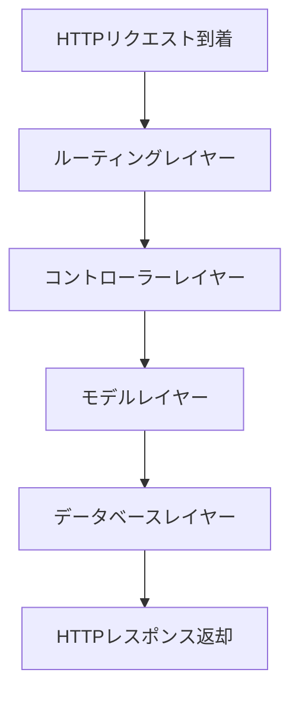

アプリケーションは、懸念事項を明確に分離した厳密なレイヤーアーキテクチャに従っています。

#### エントリーレイヤー
- `server.js` - MongoDB 接続を確立し、HTTP サーバーを起動
- `app.js` - Express ミドルウェアを設定し、ルートをマウント

#### ルーティングレイヤー
5 つのルートモジュールがリソース固有のエンドポイントを処理し、コントローラーにデリゲート

#### コントローラーレイヤー
ビジネスロジックの実装がデータモデル操作を調整

#### モデルレイヤー
検証、ミドルウェアフック、およびインスタンスメソッド付き Mongoose スキーマ

#### データベースレイヤー
永続ストレージを提供する MongoDB Atlas

---

## アプリケーションブートストラップフロー

### 初期化シーケンス

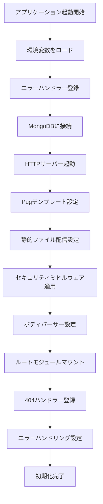

### フェーズ 1: server.js 初期化

1. `config.env` から環境変数をロード
2. 未処理の例外と未処理の Promise 拒否のためのグローバルエラーハンドラーを登録
3. 環境から接続文字列を使用して MongoDB に接続
4. 設定されたポートで HTTP サーバーを起動

### フェーズ 2: app.js 設定

1. SSR のための Pug をテンプレートエンジンとして設定
2. `/public` ディレクトリの静的ファイル配信をマウント
3. セキュリティミドルウェアスタック (helmet, レート制限, サニタイゼーション) を適用
4. 10kb のサイズ制限でボディパーシングを設定
5. 5 つのルートモジュールを各ベースパスにマウント
6. 404 エラー用のキャッチオールルートを登録
7. グローバルエラーハンドリングミドルウェアを適用

---

## リクエスト処理パイプライン

### API リクエストフロー

`/api/v1/*` エンドポイントへの API リクエストは、以下のミドルウェアチェーンに従います。

| 順序 | ミドルウェア | 目的 | 設定 |
|---|---|---|---|
| 1 | morgan | HTTP リクエストログ | 開発のみ |
| 2 | rateLimit | 悪用防止 | IP あたり 100 req/時間 |
| 3 | helmet | セキュリティヘッダー | Mapbox 用 CSP 設定 |
| 4 | express.json | JSON ボディパース | 10kb 制限 |
| 5 | cookieParser | JWT クッキーパース | - |
| 6 | mongoSanitize | NoSQL インジェクション防止 | - |
| 7 | xss | XSS 攻撃防止 | - |
| 8 | hpp | パラメータ汚染防止 | 重要なフィールドをホワイトリスト化 |
| 9 | ルート固有ミドルウェア | 認証, 認可 | 認証・認可の詳細を参照 |
| 10 | コントローラーハンドラー | ビジネスロジック | コントローラーの詳細を参照 |
| 11 | エラーハンドラー | エラー変換と送信 | - |

### リクエスト処理の詳細フロー

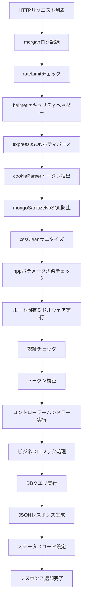

### サーバーサイドレンダリングリクエストフロー

`/` へのリクエストは同様だが、より軽量なパスをたどり、レート制限をスキップし、最終的に Pug テンプレートを HTML レスポンスにレンダリングします。

---

## コアドメインモデル

### データモデル関係図

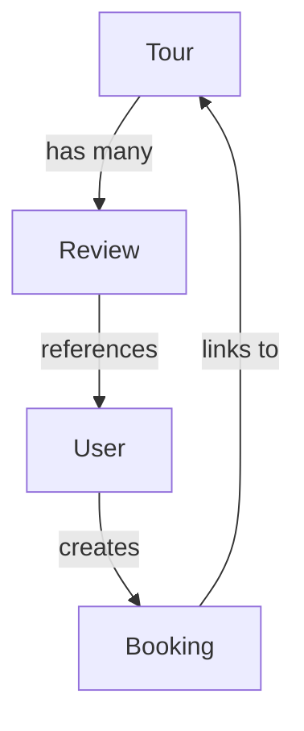

### モデル詳細

Natours アプリケーションは、以下の 4 つのコアな Mongoose モデルで構築されています。

#### Tour - ツアーエンティティ

ツアー提供を表す中央エンティティ

- 埋め込みジオスパシャルデータ (GeoJSON 形式)
- 価格設定、難易度評価
- ユーザーガイドへの参照
- 仮想集団はレビューのオンデマンドロード許可

#### User - ユーザー認証主体

- 4 つのロールをサポート: `user`, `guide`, `lead-guide`, `admin`
- bcrypt によるパスワードハッシング
- JWT トークン生成
- `active` フラグによるソフトデリーション

#### Review - レビュー関係

- ユーザーとツアー間の多対多関係
- 1～5 の評価
- ミドルウェアが親ツアーの `ratingsAverage` と `ratingsQuantity` を自動再計算

#### Booking - 予約エンティティ

- 完了した購入トランザクションを表現
- ユーザーとツアーをリンク
- 支払いステータス追跡

すべてのモデルは、検証、前処理/後処理操作、クエリ操作などの横断的関心事に対して Mongoose ミドルウェアフックを活用しています。

---

## セキュリティアーキテクチャ

Natours は、複数のレイヤーにわたる防御的な深さのセキュリティを実装しています。

### 認証フロー

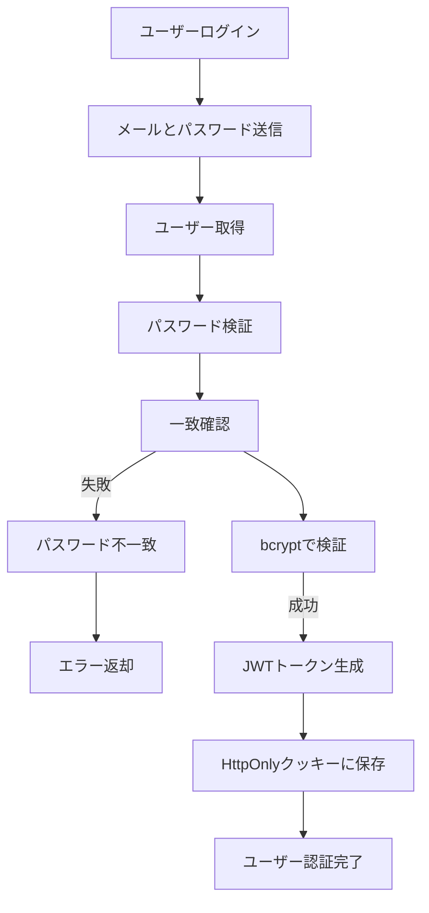

- **ステートレス JWT 認証** - HTTP のみ クッキーに保存されたトークンで XSS 攻撃を防止
- **bcrypt パスワードハッシング** - コスト係数 12 でコンピュータセキュリティを実現
- **トークン無効化** - ユーザーがパスワードを変更する際にトークン無効化 (`passwordChangedAt` タイムスタンプ比較)
- **ロールベースアクセス制御** - 4 段階階層 (`user < guide < lead-guide < admin`) を `authController.restrictTo` ミドルウェアで実装

### 入力検証・サニタイゼーション

| レイヤー | 機構 | 説明 |
|---|---|---|
| **Mongoose** | スキーマ検証 | 型チェック、範囲検証、カスタムバリデータ |
| **express-mongo-sanitize** | NoSQL 防止 | ユーザー入力から MongoDB 演算子を削除 |
| **xss-clean** | XSS 防止 | ユーザー入力をサニタイズして XSS 攻撃を防止 |
| **hpp** | パラメータ汚染防止 | ホワイトリスト設定可能なコンフィグ |

### 入力バリデーションフロー

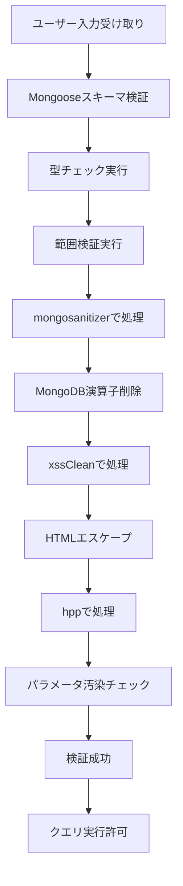

### 攻撃サーフェス削減

- **レート制限** - `/api` ルートで IP あたり 100 リクエスト/時間
- **ボディサイズ制限** - JSON および URL エンコードボディの 10kb 最大値
- **Helmet CSP** - Mapbox 統合用に設定されたコンテンツセキュリティポリシー

### エラーハンドリング

- **グローバルエラーハンドラー** - 本番環境での情報流出を防止
- **プロセスレベルハンドラー** - 未処理の例外および未処理の拒否時のグレースフルシャットダウン

---

## 外部サービス統合

| サービス | 目的 | 実装 |
|---|---|---|
| **MongoDB Atlas** | プライマリデータベース | 環境から接続文字列を使用した Mongoose ODM |
| **Stripe** | 決済処理 | チェックアウトセッションと予約確認用のウェブフック |
| **Mapbox GL JS** | インタラクティブマップ | ツアー場所を表示するクライアント側ライブラリ |
| **Nodemailer** | メール送信 | 開発用トランスポート; 本番は通常 SendGrid を使用 |
| **Sharp** | 画像処理 | サーバーサイド画像リサイズと最適化 |

### 決済処理フロー

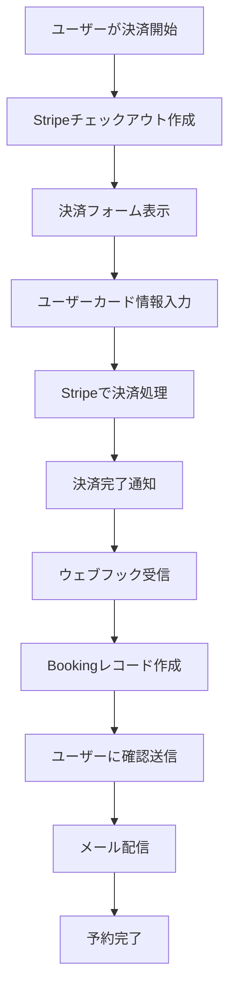

---

## 開発ワークフロー

### NPM スクリプト

| スクリプト | コマンド | 目的 |
|---|---|---|
| `start` | `nodemon server.js` | 自動再起動付き開発サーバー |
| `start:prod` | `NODE_ENV=production nodemon server.js` | 本番モードテスト |
| `debug` | `node --inspect server.js` | Node.js デバッガー有効化 |
| `watch:js` | `parcel watch` | クライアント JavaScript 自動再ビルド |
| `build:js` | `parcel build` | クライアント資産の本番ビルド |

### コード品質

- **ESLint** - Airbnb スタイルガイドと Node.js プラグイン
- **Prettier** - 自動コードフォーマッティング
- **No-console 警告** - 適切なログ記録プラクティスを強制

### 開発環境セットアップ

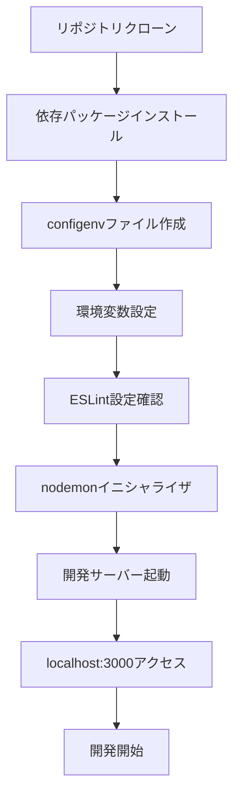

---

## API バージョニングと構造

すべての API エンドポイントはバージョン化され、`/api/v1/` でプリフィックスされています。

| エンドポイント | 機能 |
|---|---|
| `/api/v1/tours` | ツアーリソース CRUD と特殊操作 |
| `/api/v1/users` | ユーザー管理とプロファイル操作 |
| `/api/v1/reviews` | レビュー CRUD とネストされたツアールート |
| `/api/v1/bookings` | 予約作成と管理 |

API は REST 慣例に従い、標準 HTTP メソッド (GET, POST, PATCH, DELETE) を使用し、一貫した構造で JSON レスポンスを返します。

### REST API呼び出しフロー

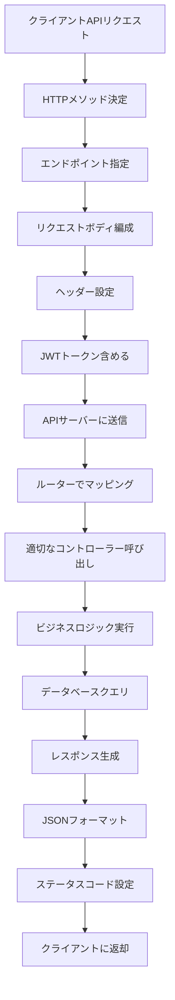

---

## キーデザインパターン

### 1. ファクトリーパターン コントローラー用

`handlerFactory` モジュールは再利用可能な CRUD 操作ジェネレータを提供し、コード重複を排除します。

```javascript
exports.deleteOne = Model => catchAsync(async (req, res, next) => {
  const doc = await Model.findByIdAndDelete(req.params.id);
  if (!doc) return next(new AppError('見つかりません', 404));
  
  res.status(204).json({
    status: 'success',
    data: null
  });
});
```

### 2. APIFeatures クエリビルダー

Mongoose クエリをラップする Fluent インターフェースクラス。

```javascript
const features = new APIFeatures(Tour.find(), req.query)
  .filter()
  .sort()
  .limitFields()
  .paginate();

const tours = await features.query;
```

### クエリビルドプロセス

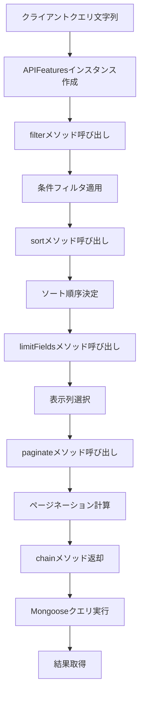

### 3. 非同期エラーハンドリング

`catchAsync` ラッパーは try-catch ボイラープレートを排除します。

```javascript
exports.getAllTours = catchAsync(async (req, res, next) => {
  const features = new APIFeatures(Tour.find(), req.query)
    .filter()
    .sort()
    .limitFields()
    .paginate();
  
  const tours = await features.query;
  
  res.status(200).json({
    status: 'success',
    results: tours.length,
    data: { tours }
  });
});
```

### エラーハンドリング処理

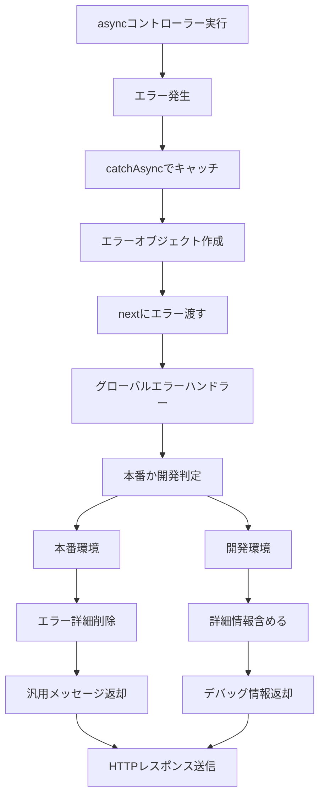

### 4. 仮想集団

ツアーは仮想集団を使用して関連レビューをオンデマンドでロードします。

---

## まとめ

Natours は、以下の特性を示す本番対応のツアー予約プラットフォームです。

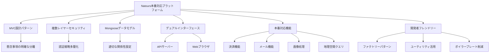

- **MVC パターンとレイヤーアーキテクチャによる関心事の明確な分離**
- **複数のミドルウェアレイヤーと認証戦略による包括的なセキュリティ**
- **適切な関係性と検証を備えた Mongoose による拡張可能なデータモデリング**
- **API コンシューマーとウェブブラウザーの両方にサービスする デュアルインターフェースサポート**
- **決済、メール、画像処理、地理空間クエリを含む本番対応機能**
- **ファクトリーとユーティリティによるボイラープレート削減の開発者フレンドリーパターン**

このドキュメントの以下のセクションでは、初期セットアップから高度な機能とデプロイメント考慮事項まで、各サブシステムの詳細なドキュメントを提供します。

---

## 関連リンク

- [Getting Started - はじめ方](https://deepwiki.com/myoshi2891/natours/2-getting-started)
- [Architecture Overview - アーキテクチャ概要](https://deepwiki.com/myoshi2891/natours/3-architecture-overview)
- [Tour Model - ツアーモデル](https://deepwiki.com/myoshi2891/natours/4.1-tour-model)
- [User Model - ユーザーモデル](https://deepwiki.com/myoshi2891/natours/4.2-user-model)
- [Review Model - レビューモデル](https://deepwiki.com/myoshi2891/natours/4.3-review-model)
- [API Endpoints - API エンドポイント](https://deepwiki.com/myoshi2891/natours/5-api-endpoints)
- [Authentication and Authorization - 認証と認可](https://deepwiki.com/myoshi2891/natours/7-authentication-and-authorization)
- [Server-Side Rendering - サーバーサイドレンダリング](https://deepwiki.com/myoshi2891/natours/8-server-side-rendering)
- [Error Handling System - エラーハンドリング](https://deepwiki.com/myoshi2891/natours/9.2-error-handling-system)
- [External Integrations - 外部統合](https://deepwiki.com/myoshi2891/natours/10-external-integrations)
- [Security - セキュリティ](https://deepwiki.com/myoshi2891/natours/11-security)
- [Development - 開発](https://deepwiki.com/myoshi2891/natours/12-development)
